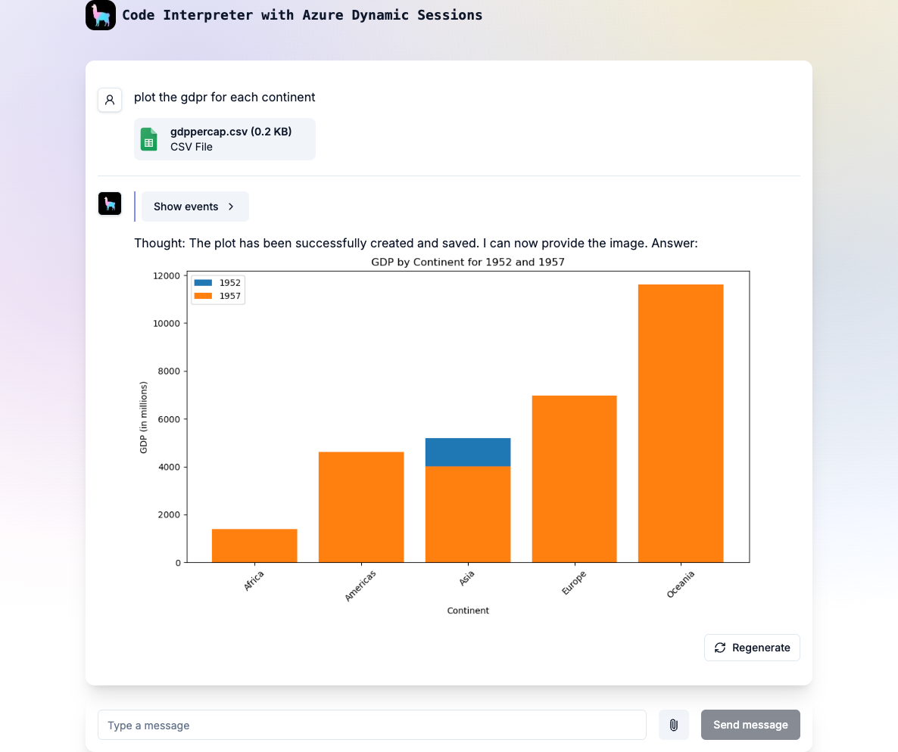
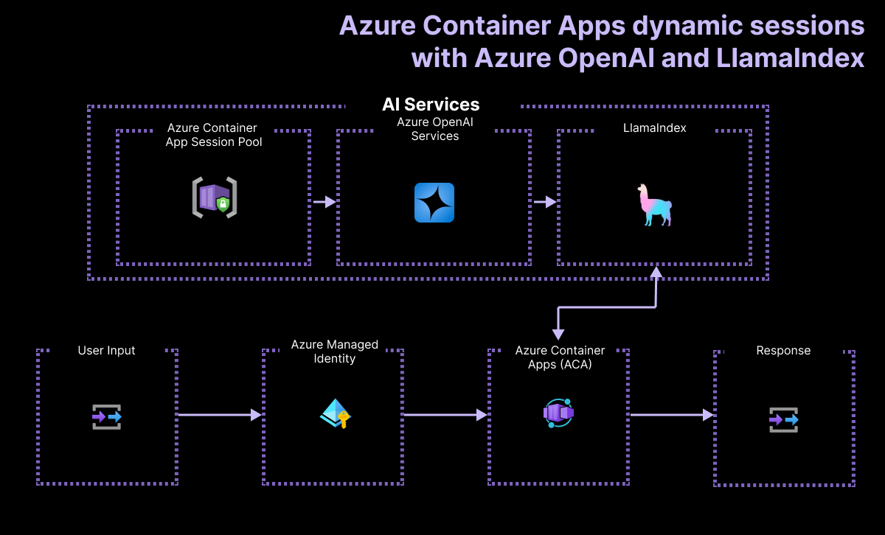

# Serverless RAG application with LlamaIndex and Azure Dyamic Sessions Tool

[](https://codespaces.new/Azure-Samples/llama-index-azure-code-interpreter?hide_repo_select=true&ref=main&quickstart=true)
[](https://codespaces.new/Azure-Samples/llama-index-azure-code-interpreter?hide_repo_select=true&ref=main&quickstart=true)
[](https://github.com/Azure-Samples/llama-index-azure-code-interpreter/actions)

[](LICENSE)

This is a [LlamaIndex](https://www.llamaindex.ai/) project using [Next.js](https://nextjs.org/) bootstrapped with [`create-llama`](https://github.com/run-llama/LlamaIndexTS/tree/main/packages/create-llama). It uses Azure Container Apps as a serverless deployment platform and Azure Dymanic Session as a tool for code interpretation.


[](#features)
[](#architecture-diagram)
[](#demo-video-optional)
[](#getting-started)
[](#contributing)
[](https://github.com/Azure-Samples/llama-index-javascript/stargazers)


  

## Important Security Notice

This template, the application code and configuration it contains, has been built to showcase Microsoft Azure specific services and tools. We strongly advise our customers not to make this code part of their production environments without implementing or enabling additional security features.

## Features

* A full-stack chat application written in [Next.js](https://nextjs.org/)
* Support for file uploads, code highlighting, and pdf rendering
* [Azure OpenAI](https://azure.microsoft.com/products/ai-services/openai-service) using gpt-4o-mini (by default)
* [Azure Container Apps](https://azure.microsoft.com/products/container-apps) for deployment
* [Azure Dynamic Sessions](https://learn.microsoft.com/azure/container-apps/sessions?tabs=azure-cli) Tool for code interpretation (Python runtime)
* [Azure Managed Identity](https://learn.microsoft.com/entra/identity/managed-identities-azure-resources/overview) for secure access to Azure services

### Architecture Diagram



### Demo Video (optional)

(Embed demo video here)

### Azure account requirements

To deploy this template, you need an Azure subscription. If you don't have an Azure subscription, create a [free account](https://azure.microsoft.com/free/) before you begin.

## Getting Started

You have a few options for getting started with this template. The quickest way to get started is [GitHub Codespaces](#github-codespaces), since it will setup all the tools for you, but you can also [set it up locally](#local-environment). You can also use a [VS Code dev container](#vs-code-dev-containers)

This template uses `gpt-4o-mini` which may not be available in all Azure regions. Check for [up-to-date region availability](https://learn.microsoft.com/azure/ai-services/openai/concepts/models#standard-deployment-model-availability) and select a region during deployment accordingly

  * We recommend using `eastus`

### GitHub Codespaces

You can run this template virtually by using GitHub Codespaces. The button will open a web-based VS Code instance in your browser:

1. Open the template (this may take several minutes)
    [](https://github.com/Azure-Samples/llama-index-azure-code-interpreter.git)
2. Open a terminal window
3. Sign into your Azure account:

    ```shell
     azd auth login --use-device-code
    ```
5. Provision the Azure resources and deploy your code:

    ```shell
    azd up
    ```

You will be prompted to select some details about your deployed resources, including location. As a reminder we recommend `eastus` as the region for this project. Once the deployment is complete you should be able to scroll up in your terminal and see the url that the app has been deployed to. It should look similar to this `Ingress Updated. Access your app at https://env-name.codespacesname.eastus.azurecontainerapps.io/`. Navigate to the link to try out the app straight away!

### VS Code Dev Containers

A related option is VS Code Dev Containers, which will open the project in your local VS Code using the [Dev Containers extension](https://marketplace.visualstudio.com/items?itemName=ms-vscode-remote.remote-containers):

1. Start Docker Desktop (install it if not already installed)
2. Open the project:
    []()
3. In the VS Code window that opens, once the project files show up (this may take several minutes), open a terminal window.
4. Sign into your Azure account:

    ```shell
     azd auth login
    ```
6. Provision the Azure resources and deploy your code:

    ```shell
    azd up
    ```
6. Install the app dependencies:

    ```bash
     npm install
    ```
8. Configure a CI/CD pipeline:

    ```shell
    azd pipeline config
    ```
To start the web app, run the following command:

```bash
npm run dev
```

Open the URL `http://localhost:3000` in your browser to interact with the bot.

### Local Environment

#### Prerequisites

You need to install following tools to work on your local machine:

* Install [azd](https://aka.ms/install-azd)
  * Windows: `winget install microsoft.azd`
  * Linux: `curl -fsSL https://aka.ms/install-azd.sh | bash`
  * MacOS: `brew tap azure/azd && brew install azd`
* Docker Desktop 
* Node.js (v20 or later)
* Git

Then you can get the project code:

1. [**Fork**](https://github.com/Azure-Samples/llama-index-azure-code-interpreter/fork) the project to create your own copy of this repository.
2. On your forked repository, select the **Code** button, then the **Local** tab, and copy the URL of your forked repository.
3. Open a terminal and run this command to clone the repo: <code> git clone &lt;your-repo-url&gt; </code>

#### Quickstart

1. Bring down the template code:

    ```shell
    azd init --template llama-index-azure-code-interpreter
    ```

    This will perform a git clone

2. Sign into your Azure account:

    ```shell
     azd auth login
    ```

3. Install all dependencies:

    ```bash
     npm install
    ```
5. Provision and deploy the project to Azure:

    ```shell
    azd up
    ```

7. Configure a CI/CD pipeline:

    ```shell
    azd pipeline config
    ```

Once your deployment is complete, you should see a `.env` file at the root of the project. This file contains the environment variables needed to run the application using Azure resources.

#### Local Development

First, install the dependencies:

```
npm install
```

Second, generate the embeddings of the documents in the `./data` directory (if this folder exists - otherwise, skip this step):

```
npm run generate
```

Third, run the development server:

```
npm run dev
```

Open [http://localhost:3000](http://localhost:3000) with your browser to see the result.

##### Local Development (Using Docker)

1. Build an image for the Next.js app:

```
docker build -t <your_app_image_name> .
```

2. Generate embeddings:

Parse the data and generate the vector embeddings if the `./data` folder exists - otherwise, skip this step:

```
docker run \
  --rm \
  -v $(pwd)/.env:/app/.env \ # Use ENV variables and configuration from your file-system
  -v $(pwd)/config:/app/config \
  -v $(pwd)/data:/app/data \
  -v $(pwd)/cache:/app/cache \ # Use your file system to store the vector database
  <your_app_image_name> \
  npm run generate
```

3. Start the app:

```
docker run \
  --rm \
  -v $(pwd)/.env:/app/.env \ # Use ENV variables and configuration from your file-system
  -v $(pwd)/config:/app/config \
  -v $(pwd)/cache:/app/cache \ # Use your file system to store gea vector database
  -p 3000:3000 \
  <your_app_image_name>
```

## Guidance

### Region Availability

This template uses `gpt-4o-mini` which may not be available in all Azure regions. Check for [up-to-date region availability](https://learn.microsoft.com/azure/ai-services/openai/concepts/models#standard-deployment-model-availability) and select a region during deployment accordingly
  * We recommend using `eastus`

### Costs

You can estimate the cost of this project's architecture with [Azure's pricing calculator](https://azure.microsoft.com/pricing/calculator/)

- Azure Container Apps: Consumption plan, Free for the first 2M executions. Pricing per execution and memory used. [Pricing](https://azure.microsoft.com/pricing/details/container-apps/)
- Azure OpenAI: Standard tier, GPT and Ada models. Pricing per 1K tokens used, and at least 1K tokens are used per question. [Pricing](https://azure.microsoft.com/pricing/details/cognitive-services/openai-service/)

> [!WARNING]
> To avoid unnecessary costs, remember to take down your app if it's no longer in use, either by deleting the resource group in the Portal or running `azd down --purge`.


### Security

This template has [Managed Identity](https://learn.microsoft.com/entra/identity/managed-identities-azure-resources/overview) built in to eliminate the need for developers to manage these credentials. Applications can use managed identities to obtain Microsoft Entra tokens without having to manage any credentials. Additionally, we have added a [GitHub Action tool](https://github.com/microsoft/security-devops-action) that scans the infrastructure-as-code files and generates a report containing any detected issues. To ensure best practices in your repo we recommend anyone creating solutions based on our templates ensure that the [Github secret scanning](https://docs.github.com/code-security/secret-scanning/about-secret-scanning) setting is enabled in your repos.

## Resources

Here are some resources to learn more about the technologies used in this sample:

- [LlamaIndexTS Documentation](https://ts.llamaindex.ai) - learn about LlamaIndex (Typescript features).
- [Generative AI For Beginners](https://github.com/microsoft/generative-ai-for-beginners)
- [Azure OpenAI Service](https://learn.microsoft.com/azure/ai-services/openai/overview)
- [Azure OpenAI Assistant Builder](https://github.com/Azure-Samples/azure-openai-assistant-builder)
- [Chat + Enterprise data with Azure OpenAI and Azure AI Search](https://github.com/Azure-Samples/azure-search-openai-javascript)

You can also find [more Azure AI samples here](https://github.com/Azure-Samples/azureai-samples).

## Troubleshooting

If you can't find a solution to your problem, please [open an issue](https://github.com/Azure-Samples/llama-index-azure-code-interpreter/issues) in this repository.

## Contributing

This project welcomes contributions and suggestions. Most contributions require you to agree to a
Contributor License Agreement (CLA) declaring that you have the right to, and actually do, grant us
the rights to use your contribution. For details, visit https://cla.opensource.microsoft.com.

When you submit a pull request, a CLA bot will automatically determine whether you need to provide
a CLA and decorate the PR appropriately (e.g., status check, comment). Simply follow the instructions
provided by the bot. You will only need to do this once across all repos using our CLA.

This project has adopted the [Microsoft Open Source Code of Conduct](https://opensource.microsoft.com/codeofconduct/).
For more information see the [Code of Conduct FAQ](https://opensource.microsoft.com/codeofconduct/faq/) or
contact [opencode@microsoft.com](mailto:opencode@microsoft.com) with any additional questions or comments.

## Trademarks

This project may contain trademarks or logos for projects, products, or services. Authorized use of Microsoft
trademarks or logos is subject to and must follow
[Microsoft's Trademark & Brand Guidelines](https://www.microsoft.com/legal/intellectualproperty/trademarks/usage/general).
Use of Microsoft trademarks or logos in modified versions of this project must not cause confusion or imply Microsoft sponsorship.
Any use of third-party trademarks or logos are subject to those third-party's policies.
